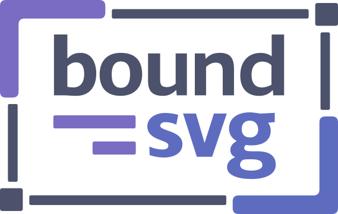
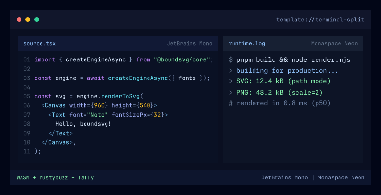
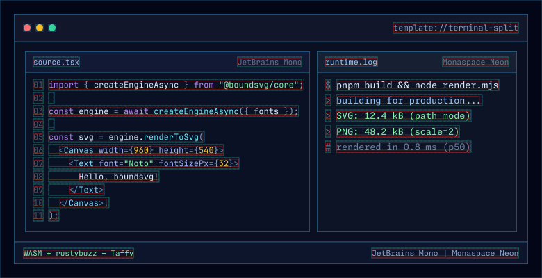
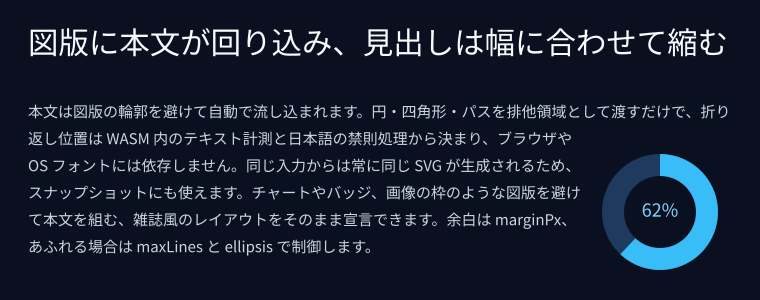
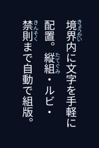
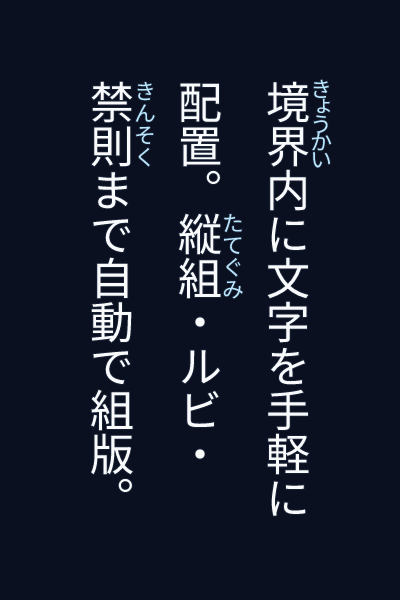

<p align="center">
  
</p>

# boundsvg

WASM-powered font measurement and layout library for SVG.

**bound** + **SVG** — Measure text bounding boxes, auto-fit fonts within containers, and apply HTML-like layouts to SVG, all without browser DOM or OS fonts.

<p align="center">
  <a href="https://zakideee.github.io/boundsvg/playground/react/"><b>Live playground</b></a>
  ·
  <a href="https://zakideee.github.io/boundsvg/">Documentation</a>
</p>

## Why

SVG has no built-in text measurement or layout: you cannot auto-size text to fit a container, wrap lines, or use flexbox the way HTML does. The usual workarounds — `canvas.measureText`, hidden DOM elements — depend on the runtime, so the same document can measure differently across OS fonts and browser engines.

boundsvg takes the runtime out of the equation. Font shaping (rustybuzz, HarfBuzz-compatible) and layout (Taffy flexbox and CSS Grid) run in WASM against fonts you supply, so measurement is exact and the SVG, PNG, WebP, and GIF output is identical regardless of environment. Text can shrink or grow to fit its container, wrap, truncate with an ellipsis, or stop at a line limit.

## Examples

The following images are generated entirely by boundsvg from JSX components —
all of them (and many more) run live in the
[playground](https://zakideee.github.io/boundsvg/playground/react/).

<p align="center">
  
</p>

That terminal is a **single SVG file** — no JavaScript, no GIF, no runtime. Layout is resolved once in WASM, and every reveal after that is declarative CSS emitted by boundsvg: the command is uncovered one glyph advance per easing step, the caret rides the leading edge, and the output lines, spinner, and progress bar are step-held keyframes on the same looping timeline.

<table>
  <tr>
    <th>Rendered output</th>
    <th>Bounds overlay (<code>debug: true</code>)</th>
  </tr>
  <tr>
    <td>
      
    </td>
    <td>
      
    </td>
  </tr>
</table>

With `debug: true`, boundsvg draws four overlay kinds: the allotted layout box (cyan), the resolved per-line layout boxes and shape part bounds (green, dashed), the measured extent of the rendered glyphs (red), and text baselines (amber). Where the red stays inside the cyan the run fits its box; where it spills — a tight line height, a heavy stroke, oversized glyphs — the overlay surfaces the overflow. It is a measurement diagnostic, not a containment guarantee. Pass `debug: { parts: [...] }` to draw only some of them.

<p align="center">
  
</p>

The heading shrink-fits its row, and the body copy flows around the chart's circular exclusion — line breaking, kinsoku, and the fitted font size are all computed in WASM.

boundsvg can also render the same JSX to both SVG and PNG independently:

<table>
  <tr>
    <th>SVG output</th>
    <th>PNG output</th>
  </tr>
  <tr>
    <td>
      
    </td>
    <td>
      
    </td>
  </tr>
</table>

<sub>Source: <a href="apps/docs/scripts/generate-examples.ts"><code>generate-examples.ts</code></a></sub>

Many more scenes — typography, geometry, text motion, and interactive demos — run live in the
**[playground](https://zakideee.github.io/boundsvg/playground/react/)**
(with a [core-API](https://zakideee.github.io/boundsvg/playground/core/) and a
[CLI-codegen](https://zakideee.github.io/boundsvg/playground/cli/) variant), or locally with
`pnpm dev:playground` (see [CONTRIBUTING.md](CONTRIBUTING.md)).

## Prerequisites

- [Node.js](https://nodejs.org/) (v20+)
- [pnpm](https://pnpm.io/) (v9+)
- [Rust](https://rustup.rs/) toolchain — `rust-toolchain.toml` pins the exact version, so `rustup` installs it for you
- [wasm-pack](https://rustwasm.github.io/wasm-pack/installer/) — `cargo install wasm-pack`

## Quick Start

```bash
pnpm install
pnpm build:wasm                       # Build WASM (Node.js target)
pnpm build:wasm:web                   # Build WASM (Browser target)
pnpm --filter @boundsvg/shape build   # Geometry package that core depends on
pnpm --filter @boundsvg/core build    # Build core TypeScript
pnpm --filter @boundsvg/browser build # Rebundle browser loader + embedded web WASM
```

> `@boundsvg/shape` must be built before `@boundsvg/core` — core's declaration build imports its types, so a clean checkout fails without it.

```tsx
// tsconfig.json: { "jsx": "react-jsx", "jsxImportSource": "@boundsvg/core" }
import { Canvas, createEngineAsync, Flex, Text } from "@boundsvg/core";
import fs from "node:fs";

const fontData = fs.readFileSync("path/to/NotoSansJP-Regular.ttf");

const engine = await createEngineAsync({
  fonts: [
    { alias: "NotoSansJP", data: fontData, weight: 400, style: "normal" },
  ],
});

const node = (
  <Canvas width={600} height={200} background="#ffffff">
    <Flex
      direction="column"
      alignItems="center"
      justifyContent="center"
      width={600}
      height={200}
    >
      <Text font="NotoSansJP" fontSizePx={32} color="#333333">
        Hello, boundsvg!
      </Text>
    </Flex>
  </Canvas>
);

const svg = engine.renderToSvg(node);
// => Produces a self-contained SVG string with precisely laid-out text
```

Not every read API reports the same coordinate space or samples animation. See
[Choosing an API](apps/docs/reference/api-selection.md) before using layout or IR data for tests,
hit-testing, or editor tooling.

## Packages

The nine publishable packages. The three playground apps under `apps/`
(React, core-API, and CLI demos) and the internal tooling packages are
private and not listed.

| Package             | Path               | Description                                                                                      |
| ------------------- | ------------------ | ------------------------------------------------------------------------------------------------ |
| `@boundsvg/core`    | `packages/core`    | Main library — text measurement, layout, SVG/PNG/WebP/GIF emit. WASM internals are encapsulated. |
| `@boundsvg/react`   | `packages/react`   | React integration — Provider, hooks, `<BoundSvg>` component for declarative rendering            |
| `@boundsvg/worker`  | `packages/worker`  | Web Worker adapter — offloads WASM rendering to a background thread                              |
| `@boundsvg/cli`     | `packages/cli`     | CLI tool — `convert`, `export`, `inspect`, `doctor`                                              |
| `@boundsvg/browser` | `packages/browser` | Browser WASM loader and SVG DOM utilities                                                        |
| `@boundsvg/video`   | `packages/video`   | Browser MP4 export — WebCodecs H.264 encoding plus a bundled MP4 muxer                           |
| `@boundsvg/shape`   | `packages/shape`   | Geometry and symbol builders behind the `Shape` / `Symbol` components                            |
| `@boundsvg/extras`  | `packages/extras`  | Unstyled utility components built on core primitives                                             |
| `@boundsvg/testing` | `packages/testing` | Test helpers — SVG snapshots, warning capture, Vitest matchers                                   |

### Rust Crates

| Crate           | Path                   | Description                                                                              |
| --------------- | ---------------------- | ---------------------------------------------------------------------------------------- |
| `boundsvg`      | `crates/boundsvg`      | WASM engine — Taffy layout, IR build, SVG/PNG/WebP/GIF emit, WOFF2 decode, rasterization |
| `boundtext`     | `crates/boundtext`     | Standalone text layout — font shaping, line breaking, kinsoku, vertical text, fit        |
| `boundshape`    | `crates/boundshape`    | Geometry kernel — path flattening, boolean ops, region division, hit-testing             |
| `boundmp4`      | `crates/boundmp4`      | MP4 container muxer compiled to WASM for `@boundsvg/video`                               |
| `boundtext-cli` | `crates/boundtext-cli` | Test runner that replays boundtext layout fixtures from JSON                             |

**boundtext** is a standalone Rust crate with no WOFF2, SVG, or WASM dependencies. It handles left-to-right text layout (font management, HarfBuzz shaping, UAX#14 line breaking, JLREQ-informed Japanese kinsoku, vertical writing, shrink/grow fit, ellipsis, rich text with ruby) and can be used independently in contexts such as PDF generation, game UI, or terminal rendering. Bidi/RTL is not implemented, and Japanese is the only line-break-prohibition profile.

> boundtext currently lives in this monorepo as a Cargo workspace member. It is designed for eventual separation into its own repository and crates.io publication once its API stabilizes and external consumers emerge.

The split between the two main crates — `boundtext` owns how text is measured, wrapped, fragmented, and fit; `boundsvg` owns how laid-out text becomes a scene and an output file — is documented in the two crate READMEs.

## Components

Layout components that work like HTML but output SVG:

- **Canvas** — Root element (width, height, background)
  - **Flex** — Flexbox container (direction, wrap, gap, align, justify)
  - **Grid** — CSS Grid container (templateColumns, templateRows, gap)
  - **Box** — Generic container (padding, margin, border, overflow)
  - **Text** — Text with precise measurement (font, fit, wrap, ellipsis, vertical writing)
    - **Inline** — Span-like text run override (color, font, size per token)
    - **InlineBox** — Atomic inline run with its own background, border, and padding
    - **InlineRect** — Inline paint primitive for carets and selection bands
    - **Ruby** — Ruby annotation container (furigana)
      - **Rt** — Ruby annotation text
  - **TextOnPath** — Text laid out along one SVG path (offset, anchor, direction, fit, overflow)
  - **Image** — Embedded image (objectFit, borderRadius)
  - **Path** — SVG path (fill, stroke, dash, opacity)
  - **Svg** — Nested raw SVG content (preserveAspectRatio, contentIdPrefix)
  - **Shape** — Geometry with boolean ops, inline or by registered `geometryId` (fill, stroke, per-part paint)
  - **Symbol** — Symbol instance, inline or by registered `symbolId`, sharing the `Shape` paint props

> Props reference: [Component docs](apps/docs/components/) covers all 16 component types. `TextOnPath` is documented in [the core API](apps/docs/api/core.md), `InlineRect` under [Text](apps/docs/components/text.md), and `InlineBox` under [Inline](apps/docs/components/inline.md).

## Key Features

- **Text** — shaping, wrapping, ellipsis, shrink/grow fit, Japanese kinsoku, vertical writing, ruby, text on an SVG path, and flow around rect / circle / path exclusions ([full text-engine spec](crates/boundtext/README.md))
- **Layout** — flexbox and CSS Grid via Taffy; box model with min/max constraints and overflow clipping
- **Geometry** — `Shape` / `Symbol` with union / subtract / intersect / xor, part-level and whole-scene hit-testing, and geometry as a text-flow exclusion
- **Animation** — declarative keyframes over opacity / translate / rotate / scale, per-cluster and per-line stagger, CSS / bezier / stepped / spring easing, deterministic sampling at any `timeMs`
- **Output** — SVG, PNG / WebP, animated WebP / GIF, browser MP4 via [`@boundsvg/video`](packages/video), layered export with a manifest, still frames, IR / layout / outline reads, and static React components from the CLI; runs in Node.js and the browser
- **Fonts** — TTF / OTF / WOFF2, variable fonts, weight/style resolution, multi-font fallback, live `engine.registerFonts()`

The complete support tiers are in the [Feature Matrix](apps/docs/reference/feature-matrix.md).

## Fonts

boundsvg requires font files (TTF/OTF/WOFF2) passed as `Uint8Array`. No OS font lookup is performed. This is by design for deterministic output.

Seven OFL-licensed families are bundled in [`fixtures/fonts/`](fixtures/fonts/) for tests and the playground demos: three Japanese subsets (Joyo kanji + Kana + Latin), two code fonts, and two variable fonts kept variable so `fontVariationSettings` has axes to move. The full list with licenses, subset details, and regeneration instructions is in [`fixtures/fonts/README.md`](fixtures/fonts/README.md). Your own fonts go through `createEngineAsync({ fonts: [...] })`, as in the Quick Start.

## Limitations

**Availability**

- Not yet published to npm. Build from source (see [Installation](apps/docs/getting-started/installation.md))

**Text**

- LTR only — no RTL or bidirectional text
- Japanese typesetting is JLREQ-informed, not JLREQ-conformant: a fixed `JaTypesettingV1` profile with greedy line breaking, hanging punctuation, and manual TCY, but no full line adjustment (行の調整処理) and no paragraph-level optimal breaking. Kinsoku is Japanese-only (`language: "ja"`); there are no zh/ko profiles
- No italic synthesis; provide italic font variants explicitly
- Vertical text: `textOrientation` supports `"mixed"` and `"upright"` (`"sideways"` is not supported)
- TCY (tate-chu-yoko / `text-combine-upright`) is experimental

**Styling**

- All units in px only (no em, rem, %, vw)
- Colors: `#RGB` / `#RRGGBB` / `#RRGGBBAA`, `rgb()`, `rgba()`, `hsl()`, `hsla()`, the 148 CSS named colors, and `transparent`. No `currentColor`, `inherit`, or `color()`

**SVG Analyzer (CLI / convert)**

- `<tspan>` per-span styles and in-rect text positions are not preserved; see [the CLI README](packages/cli/README.md) for the exact mapping rules

**Fonts**

- Bundled subset fonts cover 2,778–3,196 characters each; supply your own fonts for broader coverage

More detail — including the full support tiers and the animation/video gaps — is in
[Feature Matrix](apps/docs/reference/feature-matrix.md) and
[Known Limitations](apps/docs/reference/known-limitations.md).

## Build & Development

The Quick Start above is the minimal build. The full chain — every package in
dependency order, the test suites, E2E, and the playground dev servers — is in
[CONTRIBUTING.md](CONTRIBUTING.md).

## Documentation

Full documentation lives at **[zakideee.github.io/boundsvg](https://zakideee.github.io/boundsvg/)**:

- [Getting Started](https://zakideee.github.io/boundsvg/getting-started/introduction)
- [Component Reference](https://zakideee.github.io/boundsvg/components/canvas)
- [API Reference](https://zakideee.github.io/boundsvg/api/core)

## Related projects

- [svgent](https://github.com/zakideee/svgent) — composes agent sessions and exports them as SVG, images, and video, with boundsvg as its rendering engine

## License

Licensed under either of

- [Apache License, Version 2.0](LICENSE-APACHE)
- [MIT License](LICENSE-MIT)

at your option.
